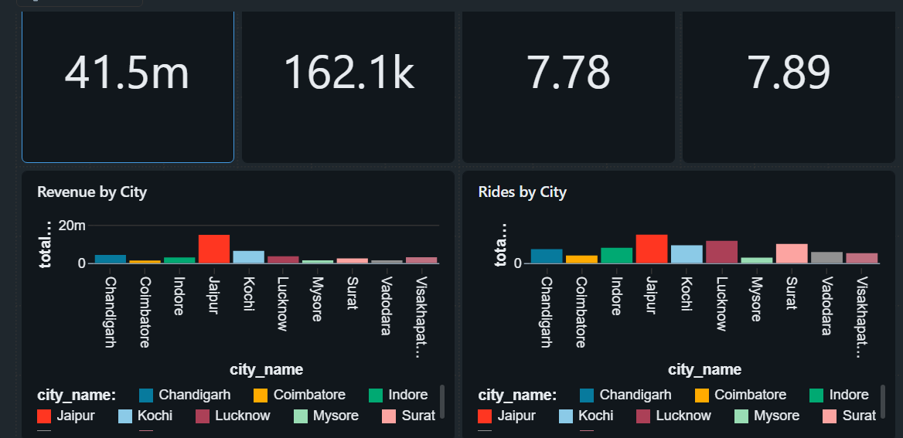
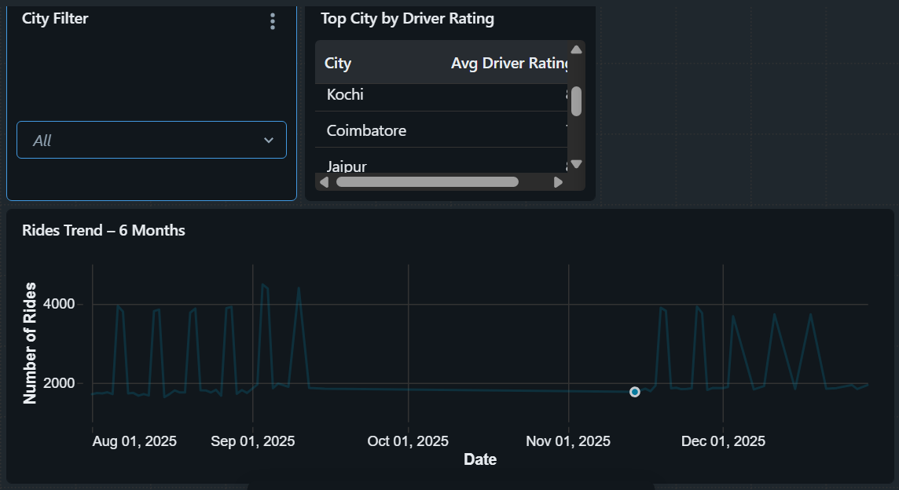

# GoodCabs – Transportation Data Processing & Analytics System

An end-to-end data engineering project built using Databricks and PySpark to process transportation data and generate useful business insights.

---

## Project Overview

GoodCabs is a transportation data engineering project that processes city and trip data through a complete ETL pipeline.

The project uses Databricks, PySpark, SQL and Delta Lake to ingest, clean, transform and analyze transportation data.

The project follows the Medallion Architecture:

**Bronze → Silver → Gold**

The final Gold datasets are used for SQL analysis, interactive dashboards and natural-language analytics using Databricks Genie.

---

## Business Objectives

The project focuses on analyzing transportation performance across different cities.

- Identify the city with the highest revenue
- Identify the city with the highest number of rides
- Analyze average passenger ratings
- Analyze average driver ratings
- Analyze revenue trends over time
- Analyze ride trends over time
- Compare transportation performance across cities

---

## Architecture

The project follows a Medallion Architecture for structured and reliable data processing.

<p align="center">
  
</p>

<p align="center">
  <i>GoodCabs Medallion Architecture</i>
</p>

---

## Technologies Used

| Technology | Purpose |
|---|---|
| Databricks | Data engineering and pipeline development |
| PySpark | Data processing and transformation |
| SQL | Business analysis |
| Delta Lake | Reliable data storage |
| Lakeflow Pipelines | Pipeline processing |
| Unity Catalog | Data organization and access control |
| AI/BI Dashboard | Data visualization |
| Databricks Genie | Natural-language analytics |
| GitHub | Version control and documentation |

---

## Data Processing

### Bronze Layer

The Bronze layer stores raw transportation data after ingestion.

**Tables:**

- `goodcabs.bronze.city`
- `goodcabs.bronze.trips`

The trips data is ingested using a streaming-based approach.

Metadata such as source file information and ingestion timestamp is also captured.

---

### Silver Layer

The Silver layer contains cleaned and transformed data with data quality validation.

**Tables:**

- `goodcabs.silver.city`
- `goodcabs.silver.trips`
- `goodcabs.silver.calendar`

**Main transformations:**

- Column renaming
- Data validation
- Processing timestamps
- Calendar transformation
- Data preparation for analytics

---

### Gold Layer

The Gold layer contains business-ready datasets for analytics and reporting.

**Tables:**

- `goodcabs.gold.gold_fact_trips`
- `goodcabs.gold.city_metrics`

The `gold_fact_trips` table combines trip, city and calendar information.

The `city_metrics` table provides important city-level KPIs:

- Total rides
- Total revenue
- Average passenger rating
- Average driver rating

---

## Data Quality

Data quality checks are applied in the Silver layer to improve data reliability.

The project validates:

- Business date
- Driver rating
- Passenger rating
- Data consistency

Example validation rules include:

- Driver rating should be between 1 and 10
- Passenger rating should be between 1 and 10
- Business date should be valid

---

## Calendar Dimension

A calendar dimension is created to support date-based analysis and transportation trend reporting.

**Table:**

`goodcabs.silver.calendar`

The calendar dimension contains:

- Date
- Date Key
- Year
- Month
- Week
- Weekday
- Quarter
- Weekend indicator

This helps in performing time-based analysis such as revenue trends and ride trends.

---

## Gold Analytics

The Gold layer is used to generate business-level insights from transportation data.

Important metrics include:

| Metric | Description |
|---|---|
| Total Rides | Total number of completed trips |
| Total Revenue | Total revenue generated from trips |
| Average Passenger Rating | Average rating given by passengers |
| Average Driver Rating | Average rating received by drivers |

City-level analysis helps identify the performance of different cities.

---

## SQL Analysis

SQL is used to analyze the Gold layer and answer important business questions.

### City-wise Transportation Performance

```sql
SELECT *
FROM goodcabs.gold.city_metrics
ORDER BY total_revenue DESC;

---

## Dashboard

An interactive Databricks AI/BI Dashboard was created to visualize transportation performance across different cities.

The dashboard provides a clear view of important business KPIs and helps compare city-level transportation performance.

### Key Metrics

- Total Revenue
- Total Rides
- Average Passenger Rating
- Average Driver Rating

### Dashboard Analysis

The dashboard includes visualizations for:

- Revenue by City
- Rides by City
- Revenue Trend
- Rides Trend
- City-wise performance
- City Filter

### Dashboard View 1

<p align="center">
  
</p>

<p align="center">
  <i>GoodCabs AI/BI Dashboard</i>
</p>

### Dashboard View 2

<p align="center">
  
</p>

<p align="center">
  <i>GoodCabs City-wise Dashboard Analysis</i>
</p>

---
